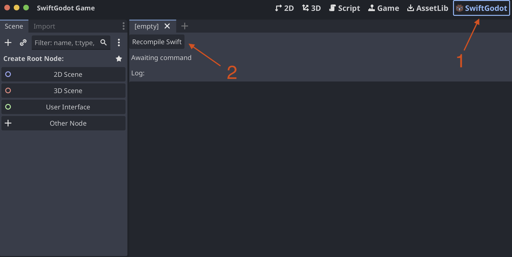

# SwiftGodotTemplate

This is a ready to use SwiftGodot project with an integrated SPM project and a small plugin to make your life a bit more convenient.

It provides a Editor tab with a button that allows you to rebuild shupped SwiftGodot SPM project in one tap and reload the editor after.

### Manully tested and supported on
- macOS
    - Swift toolchain from Xcode Version 16.3 (16E140)
    - MacBook with a M-family processor
    - Godot v4.4.1.stable.official [49a5bc7b6]

### How to use it
1. Clone this repository
2. Open Godot project in the root
3. Open `SwiftGodot` tab on top (Screenshot 1)
3. Click `Recompile Swift` (Screenshot 2)

Wait. 

The script will build the project and copy the `dylib`s to location set by `swift_godot.gdextension`.

When build is finished Godot editor will save any unsaved files and relaunch.

### How does it work
Godot Editor plugin sitting in `res://addons/swift_godot_editor_plugin` simply runs `swift build` command using [OS.create_process](https://docs.godotengine.org/en/stable/classes/class_os.html#class-os-method-create-process) with `--build-path` set to folder where `swift_godot.gdextension` expects it

### Where is SwiftGodot project?
Swift Package Manager (SPM) project dependent on `SwiftGodot` sits in `swift_godot_game` directory. It's invisible to Godot project due to `.gdignore` file in there. You can work with it in any IDE that can work with SPM and use the Editor plugin functionality to rebuild it.

